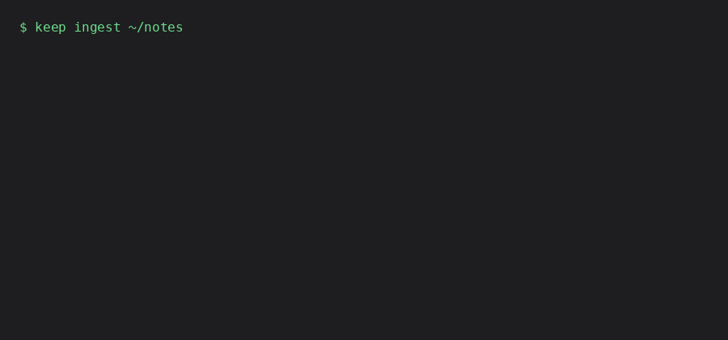

# Keep

A private, on-device assistant for macOS — sees, searches, speaks, and acts.
Nothing leaves your machine.



## What Keep does

- **Acts** — creates calendar events, reminders, and mail drafts (never sends), and finds files by name.
- **Searches** — ask questions about your own notes and documents (`keep ingest <path>`), answered from the retrieved passages. The on-device model is small, and on short/ambiguous corpora it can misstate details it's asked to extract — treat answers as a starting point, not a citation you can quote from.
- **Sees** — describes what's on your screen (`keep see`, or ask out loud).
- **Speaks** — ask by voice, hear the answer back.

All of it runs on Apple's on-device Foundation Models. No API keys, no
network calls, no cloud. You can check that claim yourself — watch a
network monitor (Little Snitch, Activity Monitor's Network tab, `nettop`)
while Keep answers a question with no `[mlx]` extra installed, and you'll
see nothing leave the machine. Privacy you can check beats privacy you have
to trust.

## Requirements

macOS 26+, Apple Silicon, with Apple Intelligence enabled (Settings →
Apple Intelligence & Siri). Keep's on-device model won't load without it --
`keep --version` and `keep ingest` still work on any Mac, but every command
that needs the model gives one clear message instead of a crash if it's
unavailable.

## Install

Requires **Python 3.10+** in a virtual environment — Keep's model provider
dependency won't resolve at all under macOS's system Python (3.9), and
Homebrew's Python refuses a bare `pip install` (PEP 668):

```
python3 -m venv venv
source venv/bin/activate
pip install git+https://github.com/rajanshxrma/keep
keep-menubar   # launches the menu bar app
```

or run it without the menu bar shell:

```
keep "remind me to call the dentist tomorrow"
keep ingest ~/Documents/some-notes
keep see
keep --voice
```

The first command in a fresh process takes ~30s while the on-device model
loads — the CLI doesn't print anything until it's done, so this looks stuck
but isn't. Every call after that is a few seconds.

### Prebuilt app (unsigned)

A prebuilt `Keep.app` is attached to each [release](https://github.com/rajanshxrma/keep/releases).
It isn't signed — I'm a student, and Apple's $99/year developer program
isn't something I can justify for a free project yet. On current macOS
(Sequoia and later), the app opens straight to **"Keep" is damaged and
can't be opened. You should move it to the Trash.** — no Open button, and
Privacy & Security's Open Anyway doesn't appear for this verdict either. It
looks alarming but isn't; it's Gatekeeper being strict about unsigned
software, not a real problem with the app. One terminal command fixes it:

```
xattr -dr com.apple.quarantine Keep.app
```

This happens once. Keep never touches the network — you can watch.

## Where Keep came from

Keep merges three projects built and shipped separately: **[private-agent](https://github.com/rajanshxrma/private-agent)**
(the agent core — tool-calling, calendar/reminders/mail, the voice front-end),
**[stacks](https://github.com/rajanshxrma/stacks)** (semantic search over
your own files), **[lantern](https://github.com/rajanshxrma/lantern)**
(on-device screen description). Their repos stay up as the standalone
originals; this is where the three converge into one product.

## Research

Building the agent core surfaced a real, measured finding about on-device
tool-calling and self-computed dates — see
[docs/eval-findings.md](docs/eval-findings.md) for the full numbers and
methodology (63 real trials, no mocks, every created artifact verified then
cleaned up). It's the reason `_dates.py` never lets a model compute its own
relative date.

## Contributing

`contract.md` is the release gate — every testable assertion a release has
to pass. `pip install -e ".[dev]" && pytest` runs the real (no-mock) test
suite; most tests touch the real Calendar/Reminders/Mail apps and the real
on-device model, and clean up after themselves.

## License

MIT
